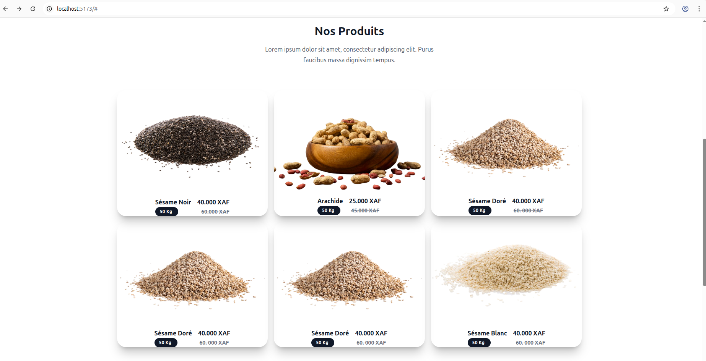
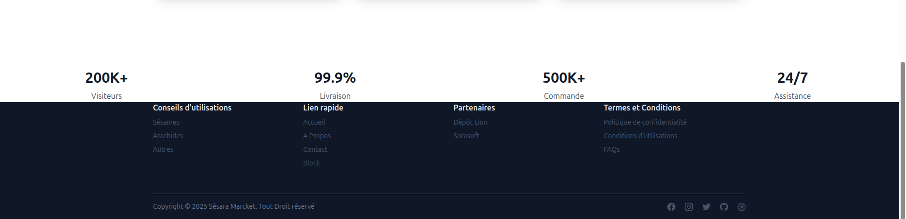

# La structure du Projet
 Ce site consiste a créée un site de vente de sésame et d'arachide en ligne nommé Sésara Marcket

le projet est structurer de manière suivante : 
1. L'entête (Header), dans le header on trouve les différentes menus de navigation, le logo du site , un champs de recherchr qui va permettre aux visiteurs ou clients d'effectuer des recherches sur les produits qu'il souhaite et un profil pour l'utilisation. ce site ayant responsive il y a le menu burger sur les mobiles

2. Le hero, dans cette section d'accueil on trouve deux boutons CTA, un message de bienvenue, une petite description du site et le logo du site qui à une forme de panier 

3. Le Feature, dans cette partie de la page d'accueil de sésara marcket on trouve les différentes produits qui à vendre sont entre autre les sésames et l'arachide et le statistique  des services que sésara marcket a offert à ses clients.

4. le pied de page (Footer), comme son nom l'indique, ici marque la fin de la de notre page d'accueil, dans cette section on trouve le racourcis des menus de navigations, le non et le logo des partenaires, les termes et conditions et en fin les conseils et les biens faits des sésames, arachide.

5. Dans ce point 5 sur la structure du projet je souhaite vous donnez la structure du Dashbord mais comme je n'ai pu afficher ce dashbord sur le navigateur je ne sais quoi dire à ce point

# Difficulté rencontrer

Les difficueltés que j'ai rencontré lors de la réalisation de ce projet sont multiple mais j'ai à les resoudres mais une parmis ces difficultés je n'ai pas pu resoudre une parmis elle celle de l'affichage du tableau de bord (Dashbord) lorsque l'utilisateur clique sur l'icône du profil, j'ai fais le routage mais lorsqu'on clique sur l'icône de profil de l'utilisation une page vide s'affiche et pourtant il ya des codes sur le composant Dashbord.tsx, SiderLayout. 

                              **********************************************************************
                              *               Merci pour votre aimable attention                   *
                              **********************************************************************
# Capture du site

    

# React + TypeScript + Vite

This template provides a minimal setup to get React working in Vite with HMR and some ESLint rules.

Currently, two official plugins are available:

- [@vitejs/plugin-react](https://github.com/vitejs/vite-plugin-react/blob/main/packages/plugin-react) uses [Babel](https://babeljs.io/) for Fast Refresh
- [@vitejs/plugin-react-swc](https://github.com/vitejs/vite-plugin-react/blob/main/packages/plugin-react-swc) uses [SWC](https://swc.rs/) for Fast Refresh

## Expanding the ESLint configuration

If you are developing a production application, we recommend updating the configuration to enable type-aware lint rules:

```js
export default tseslint.config([
  globalIgnores(['dist']),
  {
    files: ['**/*.{ts,tsx}'],
    extends: [
      // Other configs...

      // Remove tseslint.configs.recommended and replace with this
      ...tseslint.configs.recommendedTypeChecked,
      // Alternatively, use this for stricter rules
      ...tseslint.configs.strictTypeChecked,
      // Optionally, add this for stylistic rules
      ...tseslint.configs.stylisticTypeChecked,

      // Other configs...
    ],
    languageOptions: {
      parserOptions: {
        project: ['./tsconfig.node.json', './tsconfig.app.json'],
        tsconfigRootDir: import.meta.dirname,
      },
      // other options...
    },
  },
])
```

You can also install [eslint-plugin-react-x](https://github.com/Rel1cx/eslint-react/tree/main/packages/plugins/eslint-plugin-react-x) and [eslint-plugin-react-dom](https://github.com/Rel1cx/eslint-react/tree/main/packages/plugins/eslint-plugin-react-dom) for React-specific lint rules:

```js
// eslint.config.js
import reactX from 'eslint-plugin-react-x'
import reactDom from 'eslint-plugin-react-dom'

export default tseslint.config([
  globalIgnores(['dist']),
  {
    files: ['**/*.{ts,tsx}'],
    extends: [
      // Other configs...
      // Enable lint rules for React
      reactX.configs['recommended-typescript'],
      // Enable lint rules for React DOM
      reactDom.configs.recommended,
    ],
    languageOptions: {
      parserOptions: {
        project: ['./tsconfig.node.json', './tsconfig.app.json'],
        tsconfigRootDir: import.meta.dirname,
      },
      // other options...
    },
  },
])
```
